# PlantApp

HUBX Flutter case. Onboarding, paywall and home screens.

iPhone 16 Pro

  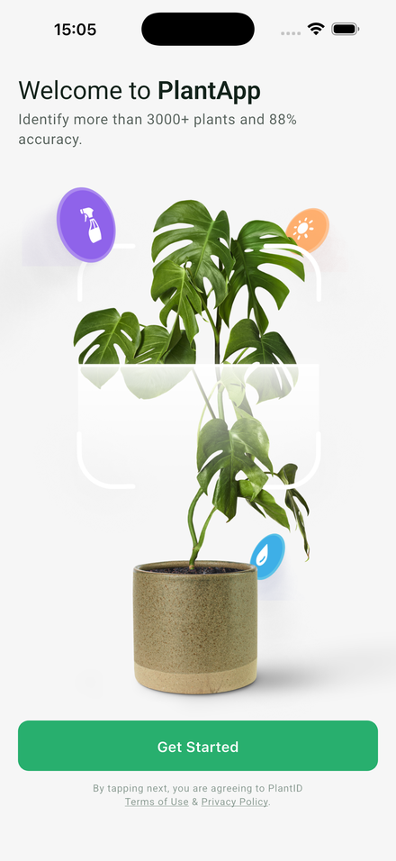
  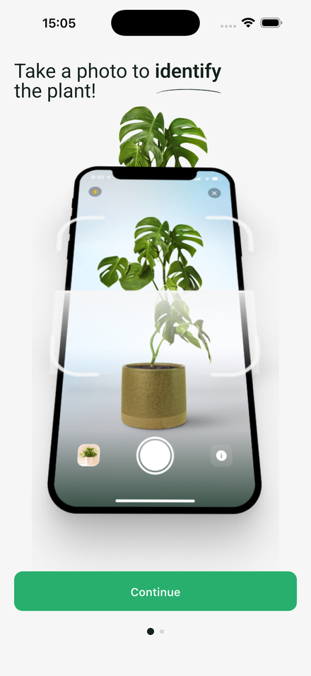
  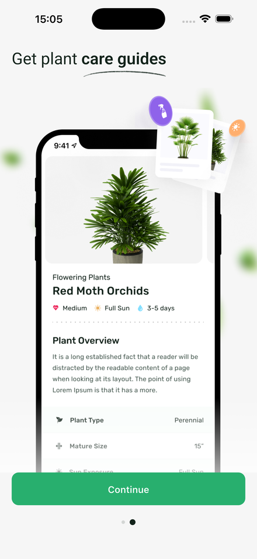
  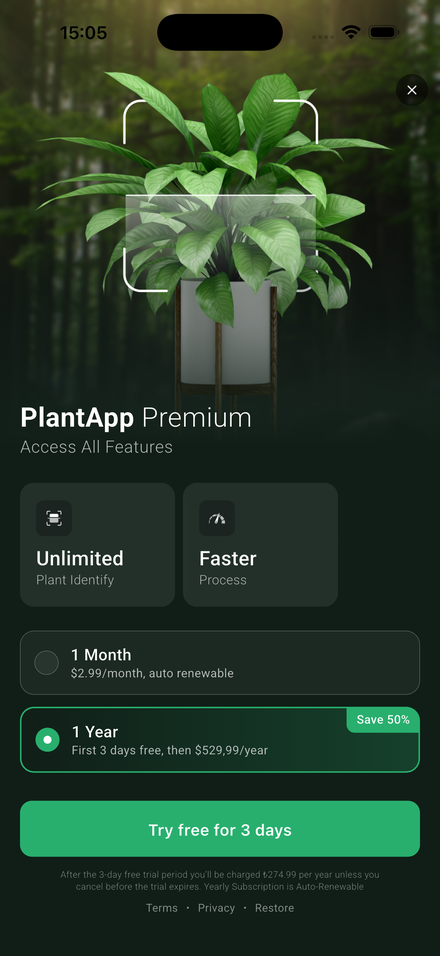
  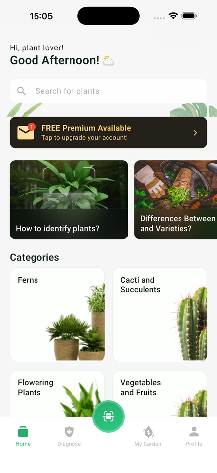

iPhone 17 Pro Max

  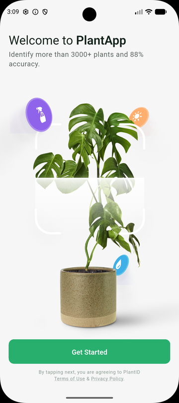
  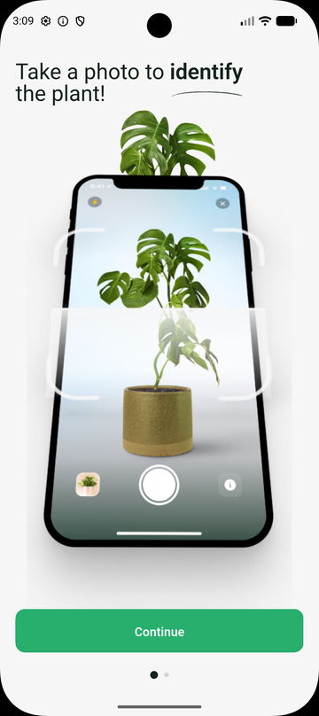
  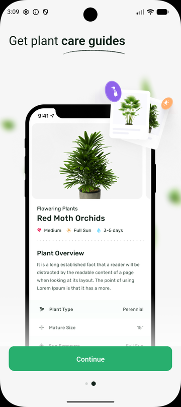
  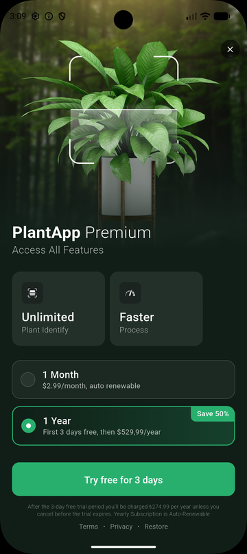
  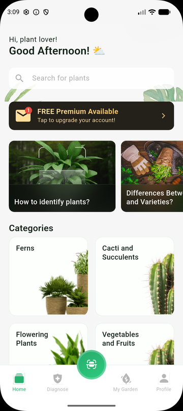

Android

  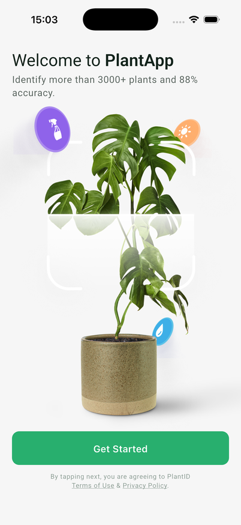
  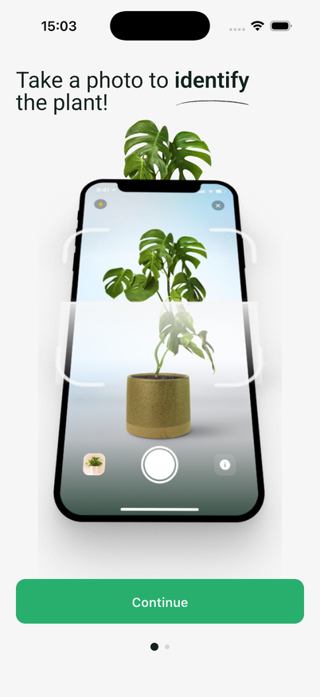
  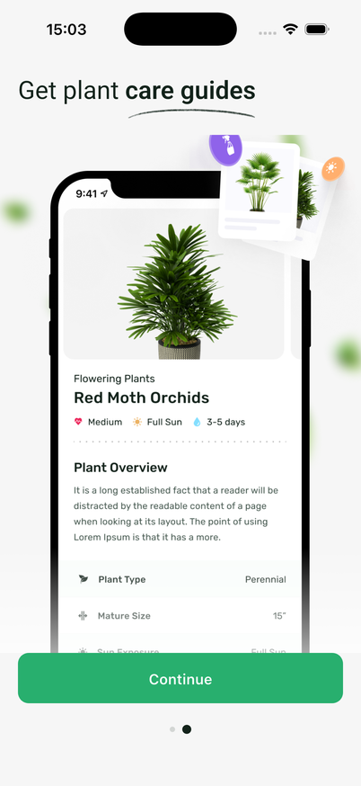
  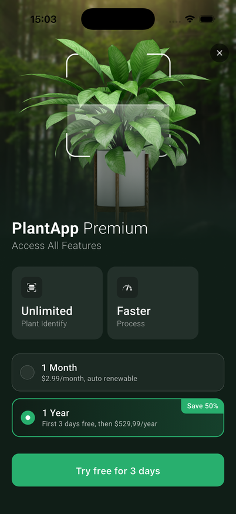
  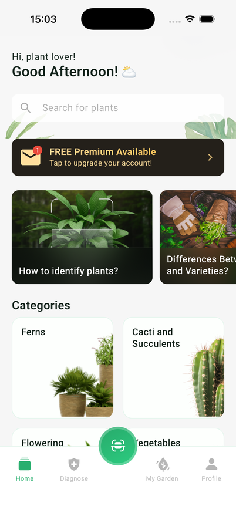

`flutter_bloc` · `dio` · `freezed` · `json_serializable` · `auto_route` ·
`get_it` + `injectable` · `shared_preferences` · `cached_network_image` ·
`bloc_test` + `mocktail`
